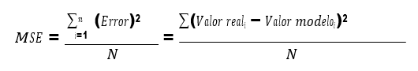

## Laboratorio de fundamentos de automatización - Identificación dinámica de procesos  - UdeA

# Objetivo general

Generar el modelo de un sistema físico a través de pruebas realizadas en la planta.

# Objetivos específicos

•	Hallar la Respuesta Temporal, RT, de un sistema físico ante una entrada tipo escalón.
•	Hallar modelos matemáticos de primero y segundo orden del sistema.
•	Simular y comprobar la validez del modelo.

# PROCEDIMIENTO

En esta práctica se generarán pruebas en la planta y con base en la respuesta del sistema se podrá obtener diferentes modelos del mismo. Se trabajará con el sistema en lazo abierto y se obtendrán modelos dinámicos debido a que se tiene en cuenta la respuesta del sistema en el tiempo.

La señal de excitación al sistema será tipo escalón, la amplitud del escalón variará dependiendo el módulo de trabajo.
1.	Identifique para el sistema asignado la variable controlada, manipulada, los valores mínimo y máximo de operación del sistema asignado tanto en unidades de ingeniería y en unidades de medición de la variable de interés.
2.	A continuación se describe el procedimiento a realizar experimentalmente.
•	Utilice los sistemas de supervisión del laboratorio para realizar la adquisición de datos de cada uno de los experimentos realizados.
•	Configure el controlador del sistema para trabajar manual.
•	Con el sistema dispuesto para operación, seleccione un valor de apertura de válvula tal que permita que la variable controlada alcance el punto de operación asignado por el docente para cada uno de los módulos. Se requiere que el sistema alcance el estado estable. Estos valores serán el punto de operación de su sistema y es importante que los incluya en el informe ya que los necesitará para la elaboración del controlador.
•	Genere un pequeño escalón en la apertura de la válvula, específicamente del 5%. Capture el comportamiento en el tiempo de las señales de entrada y salida de su sistema.

# ELABORACIÓN DE MODELOS

Todo el análisis de datos y la generación de modelos se realizará con Matlab, así que es necesario llevarse la información de los archivos de mediciones en Excel generados por el SCADA, para que puedan ser manipulados desde Matlab.

En general es necesario depurar los datos antes de poder analizarlos en Matlab. Para los módulos de nivel de dos tanques y el de presión, se deben organizar los datos de manera que se garantice el periodo de muestreo de un segundo.

1.	Grafique en una sola figura la señal de entrada (escalón en % apertura) y la salida (variable controlada).

  

Grafica 1: señal de entrada(Escalón) y señal de salida(Variable controlada)

Se puede ver que en la obtención de los datos había un porcentaje de apertura del 18%, luego se generó una apertura de 5% obteniendo una apertura del 23%.

2.	Grafique nuevamente los datos, pero eliminando cualquier valor de offset, es decir, pase a variable desviación.

3.	Con la información del punto anterior genere los modelos con las siguientes especificaciones:
•	Modelo de primer orden con tiempo muerto (Bibliografía)
•	Modelo de segundo orden con tiempo muerto (Bibliografía)
•	Modelo de primer orden con tiempo muerto con la herramienta identificación de modelos de Matlab.
•	Modelo de segundo orden con tiempo muerto con la herramienta identificación de modelos de Matlab.

Para los modelos de segundo orden asegúrese que sean de polos diferentes (proceso sobre amortiguado), luego serán cuatro los modelos calculados.

4.	Grafique en una sola figura la respuesta del sistema (punto 2) y la respuesta del modelo utilizando un escalón de la misma magnitud que el realizado en forma experimental. Repita el procedimiento para todos los modelos hallados.

Observe las gráficas, compare los resultados y elija los modelos de primer y segundo orden que mejor se ajustan.

A continuación, utilice el criterio de la raíz del error cuadrático medio cuadrado, para elegir los mejores modelos, uno de primer orden y otro de segundo orden.

  

Donde N es el número de datos, tamaño del vector.

